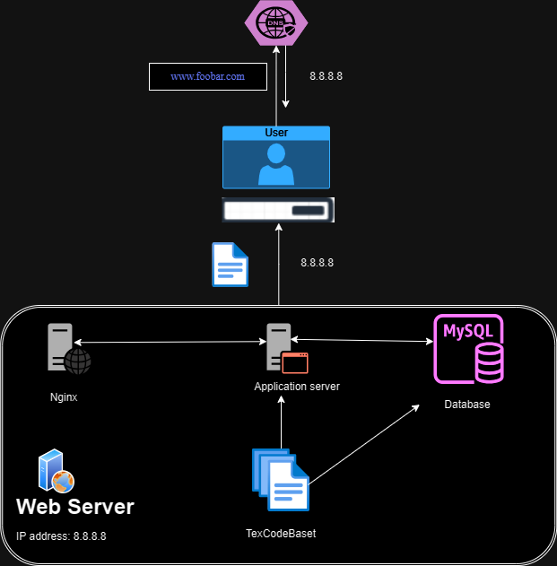

# Basic Web Stack

## Overview

This uncomplicated web infrastructure hosts a website accessible through `www.foobar.com`. It lacks firewalls or SSL certificates to safeguard the server's network, and resources (CPU, RAM, and SSD) are shared among components like the database and application server.

## Key Details About This Setup

+ **Server Definition:** A server, whether hardware or software, furnishes services to other computers, commonly referred to as *clients*.

+ **Domain Name's Role:** It offers a human-friendly alias for an IP address, enhancing recognition and recall. For instance, `www.wikipedia.org` is more user-friendly than `91.198.174.192`. This mapping is handled by the Domain Name System (DNS).

+ **DNS Record for `www` in `www.foobar.com`:** Utilizes an **A record**, confirmed through the command `dig www.foobar.com`. Please note that actual results may vary, but in this design, an **A** record is employed. 
<i>A Record (Address Mapping record)—also known as a DNS host record—stores a hostname and its corresponding IPv4 address.</i>

+ **Web Server's Role:** It is a software/hardware that processes requests via HTTP or secure HTTP (HTTPS) and delivers the requested content or an error message.

+ **Application Server's Role:** It installs, operates, and hosts applications and services for end users, IT services, and organizations, facilitating the hosting and delivery of high-end consumer or business applications.

+ **Database's Role:** Maintains an organized collection of information that is easily accessible, managed, and updated.

+ **Client-Server Communication:** Communication transpires over the internet network through the TCP/IP protocol suite.

## Challenges in This Infrastructure

+ **Single Point of Failure (SPOF) Concerns:** Multiple SPOFs exist; for instance, if the MySQL database server fails, the entire site becomes inaccessible.

+ **Downtime During Maintenance:** Conducting maintenance checks requires shutting down components or the server. With only one server, this results in website downtime.

+ **Limited Scalability:** Scaling proves challenging due to the consolidated components on one server. The server may struggle with resource shortages or slowdowns during periods of high incoming traffic.