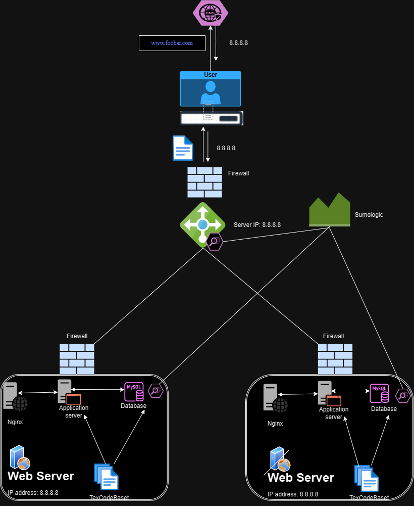

# Secure and Monitored Web Infrastructure

## Overview

This web infrastructure consists of three servers, emphasizing security, monitoring, and the facilitation of encrypted traffic.

## Key Details About This Setup

+ **Firewalls' Purpose:** Firewalls act as a protective barrier for the web servers, preventing unwanted and unauthorized access. Positioned between the internal and external networks, they block incoming traffic that matches predefined criteria, enhancing network security.

+ **SSL Certificate's Role:** SSL certificates encrypt traffic between web servers and the external network, thwarting potential man-in-the-middle attacks and preventing network sniffers from extracting sensitive information. These certificates ensure privacy, integrity, and identification.

+ **Monitoring Clients' Function:** Monitoring clients are instrumental in overseeing both servers and the external network. They analyze server performance, measure overall health, and promptly alert administrators to deviations from expected performance. Monitoring tools provide key metrics, automatically test server accessibility, gauge response times, and detect issues such as corrupt/missing files, security vulnerabilities, or violations.

## Challenges in This Infrastructure

+ **SSL Termination at Load Balancer Level:** SSL termination at the load balancer could leave traffic between the load balancer and web servers unencrypted, potentially compromising the security of this segment of the communication.

+ **Single MySQL Server as a Point of Concern:** The presence of a single MySQL server raises scalability issues and introduces a potential single point of failure for the entire web infrastructure.

+ **Uniform Components on Servers:** Servers with identical components may contend for resources like CPU, memory, and I/O, leading to suboptimal performance. Additionally, this uniform setup complicates scalability and makes it challenging to pinpoint the source of problems. A diversified configuration could offer better resource allocation and scalability options.