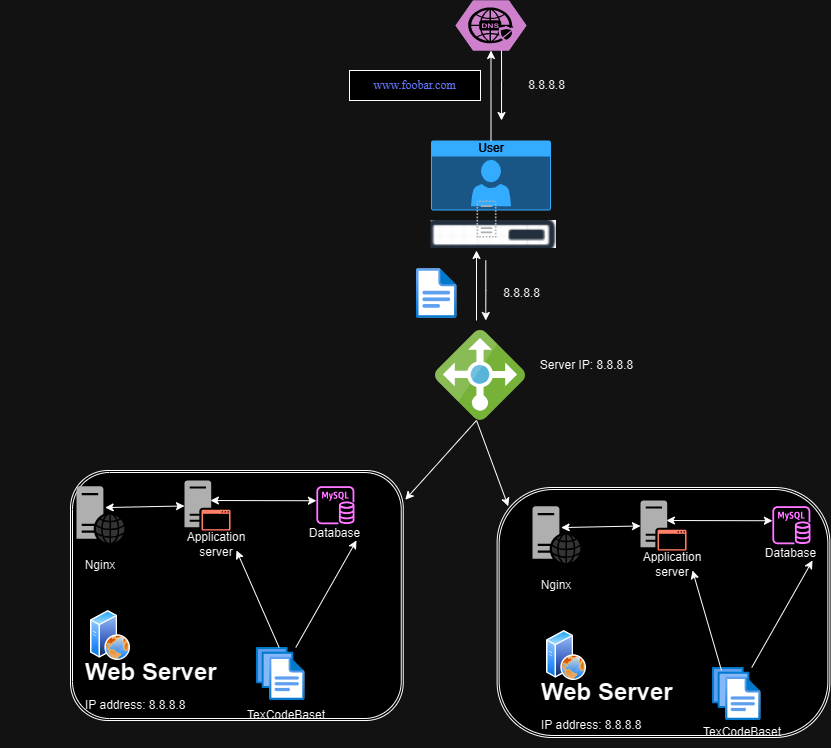

# Decentralized Web Infrastructure

[Explore the Board](https://miro.com/app/board/uXjVOfI6jcU=/)

## Overview

This distributed web infrastructure aims to alleviate traffic on the primary server by distributing some of the load to a replica server, managed by a load balancer responsible for balancing the workload between the primary and replica servers.

## Key Details About This Setup

+ **Load Balancer Distribution Algorithm:** The HAProxy load balancer employs the *Round Robin* distribution algorithm. This algorithm cycles through each server behind the load balancer based on their weights, ensuring an equitable distribution of processing time. It's a dynamic algorithm allowing adjustments to server weights on the fly.

+ **Load-Balancer-Enabled Setup:** The HAProxy load balancer facilitates an *Active-Passive* setup instead of an *Active-Active* one. In an *Active-Active* configuration, workloads are distributed across all nodes to prevent overloading a single node. Conversely, in an *Active-Passive* setup, not all nodes are constantly active, and the passive node becomes active if the preceding one is inactive.

+ **Primary-Replica Database Cluster Operation:** In a *Primary-Replica* (*Master-Slave*) setup, one server serves as the *Primary* handling read/write requests, while the other acts as a *Replica* capable of handling only read requests. Data synchronization occurs when the *Primary* server executes a write operation.

+ **Role Difference Between Primary and Replica Nodes:** The *Primary* node manages all write operations for the site, while the *Replica* node processes read operations, reducing read traffic on the *Primary* node.

## Challenges in This Infrastructure

+ **Multiple Single Points of Failure (SPOF):** Several SPOFs exist; for instance, if the Primary MySQL database server fails, the entire site loses the ability to make changes. The server housing the load balancer and the application server connecting to the primary database server are also potential SPOFs.

+ **Security Concerns:** Data transmitted over the network lacks encryption using an SSL certificate, posing a risk of unauthorized access. Additionally, the absence of firewalls on any server leaves no means to block unauthorized IPs.

+ **Lack of Monitoring:** Absence of server monitoring tools means there is no way to ascertain the real-time status of each server, leaving potential issues undetected.