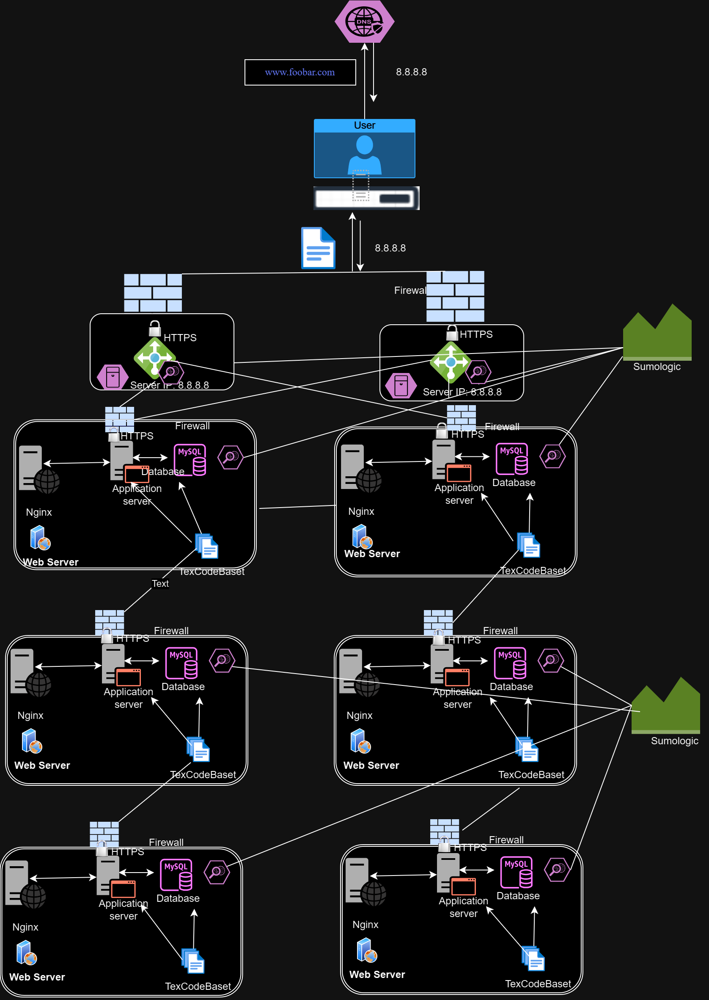

# Scale up/Expanded Web Infrastructure

## Overview

This evolved web infrastructure represents an expansion of the previously described setup [here](2-secured_and_monitored_web_infrastructure.md). In this version, all Single Points of Failure (SPOFs) have been eliminated, and major components (web server, application server, and database servers) are now hosted on separate GNU/Linux servers. SSL protection is not terminated at the load balancer, and each server's network is fortified with a firewall while being actively monitored.

## Key Details About This Setup

+ **Individual Firewalls for Each Server:** A firewall is implemented for each server, safeguarding them against unwanted and unauthorized access. This ensures that each server is independently protected, enhancing overall security.

## Challenges in This Infrastructure

+ **Elevated Maintenance Costs:** The decision to allocate each major component to its dedicated server introduces higher maintenance costs. Acquiring additional servers increases upfront costs, and the operational expenses, including electricity consumption, escalate. This impacts the company's budget, requiring funds for both server acquisition and ongoing operational expenses.